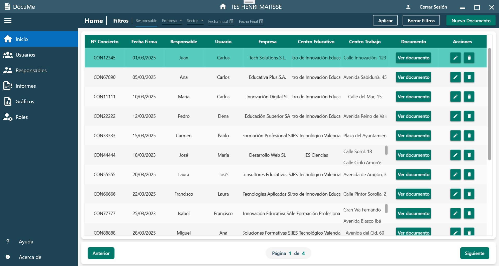

# 📄 DocuMe - Sistema de Gestión Documental

**DocuMe** es una aplicación de escritorio desarrollada con WPF y C# (.NET 8), orientada a la gestión eficaz de documentos PDF en centros educativos, especialmente enfocada a la documentación de las FCT. Permite almacenar, buscar, clasificar y generar documentos con facilidad, aportando una solución completa a los problemas de organización documental.

## 📌 Características Principales

- Gestión de usuarios, roles y permisos.
- Almacenamiento y búsqueda avanzada de documentos PDF.
- Generación de documentos PDF (contratos, informes, estadísticas).
- Gráficos interactivos sobre la actividad documental.
- Sistema de login con roles (administrador, profesor, etc.).
- Exportación de informes y gráficos a PDF.
- Interfaz moderna y atractiva basada en Material Design.
- Sistema de logs y validación de formularios.

## 🛠️ Tecnologías y Herramientas

- **Lenguaje:** C# con .NET 8
- **Interfaz gráfica:** WPF + XAML
- **Base de datos:** MySQL
- **ORM:** Entity Framework Core
- **Diseño gráfico:** Canva, Photopea
- **Generación de PDFs:** QuestPDF
- **Estilos visuales:** MahApps.Metro, MaterialDesignInXAML, Fluent.Ribbon
- **Gráficos:** LiveCharts.Wpf
- **Logging:** NLog

## 🧱 Arquitectura

DocuMe sigue el patrón **MVVM** y está estructurado en los siguientes módulos:

- `Backend/`: Modelos de base de datos y clases de utilidad.
- `Frontend/`: UserControls, formularios y vistas.
- `MVVM/`: ViewModels y clases base para la lógica de presentación.
- `Servicios/`: Acceso y lógica de negocio conectada a MySQL.
- `Estilos/`: Recursos visuales y estilos reutilizables.
- `Recursos/`: Imágenes e íconos.

## 🗃️ Base de Datos

Modelo relacional diseñado en MySQL con relaciones entre:

- **Usuarios** (con roles y permisos)
- **Documentos** (asociados a centros, empresas y usuarios)
- **Empresas, Responsables y Centros de trabajo**
- **Centros educativos**

La integridad referencial se gestiona mediante claves foráneas.

## 📊 Funcionalidades Destacadas

### Gestión documental

- Subida, edición y eliminación de documentos.
- Filtros por sector, responsable, empresa, fechas, etc.
- Generación de documentos desde plantilla o asignación de PDFs ya existentes.

### Usuarios y roles

- Gestión de usuarios con permisos personalizados.
- Alta/baja de usuarios sin perder trazabilidad de sus documentos.

### Gráficos e informes

- Estadísticas anuales y por sector.
- Exportación a PDF de gráficos y datos.
- Visualización clara y moderna de la información.

### Seguridad y control

- Validación de formularios en tiempo real.
- Verificación de contraseñas para cambios.
- Registro de eventos con NLog.

## 🎮 Cómo usar la aplicación

1. **Inicio:** SplashScreen seguido del login.
2. **Home:** Menú de navegación lateral con las principales funcionalidades.
3. **Documentos:** Buscar, crear, editar, eliminar y generar PDFs.
4. **Usuarios y Roles:** Gestión según permisos.
5. **Informes y gráficos:** Generación y exportación a PDF.
6. **Configuración del perfil:** Cambio de contraseña y centro educativo (según rol).

## 🔐 Roles y permisos

- **Administrador:** Acceso total.
- **Profesor:** Solo puede gestionar sus propios documentos.

## 🧪 Estado del proyecto

✅ Funcional  
📦 Modular  
🔧 Ampliable  
📈 Usabilidad probada

## 🚀 Instalación

1. Clona el repositorio:
   git clone https://github.com/Nolagplss/ProyectoGestionDocumental.git

2. Abre la solución en Visual Studio.

3. Restaura los paquetes NuGet.

4. Ejecuta el script SQL en tu servidor MySQL.

5. Dale al boton ejecución arriba del todo en el medio.

6. Inicia sesion con un usuario con el Rol de Admin o profesor. Ejemplos:
   -Admin: carlos.garcia@example.com 123456
   -Profesor: lucia.martinez@example.com 123456 

## 🖼️ Capturas de pantalla

Pantalla principal:  

Acuerdo en pdf:  

Gráficos generados en PDF:  

Informes generados en PDF:  

---

## 👨‍💻 Autor

**Samuel Radu Dragomir**  
2º DAM  
Proyecto Final de Desarrollo de Aplicaciones Multiplataforma

---

## 📝 Licencia

Este proyecto ha sido desarrollado por **Samuel Radu Dragomir** como parte de su proyecto final de 2ºDAM.

Queda estrictamente prohibido el uso, copia, distribución o modificación de este software sin el consentimiento expreso del autor.  
**No se permite su uso con fines comerciales por terceros.**

© 2025 Samuel Radu Dragomir. Todos los derechos reservados.

